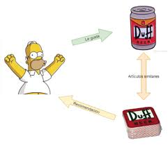

# PI_MLOPs


## Resumen
En este proyecto se ejecuta un MPV (Minimum Viable Product) con una base de datos de la empresa de videojuegos. El primer paso realizado consistió en el proceso de extracción, transformación y carga (ETL), seguido del análisis exploratorio (EDA) con el objetivo de tener datasets más compactos y livianos. Estos son compatibles con Render, una plataforma de computación en la nube que permite lanzar y escalar aplicaciones web, APIs y más de manera rápida y sencilla, facilitando la implementación y mantenimiento de proyectos sin necesidad de gestionar servidores físicos.

También se presenta un sistema de recomendación usando el modelo de similitud del coseno, que mide la similitud entre dos vectores calculando el coseno del ángulo entre ellos.

## Objetivo
Generar una API (MPV) que permita realizar consultas específicas, acorde a los endpoints requeridos e incluir un sistema de recomendación usando el modelo de similitud del coseno.

## Desarrollo (ETL-EDA)
Se cuenta con tres archivos en formato JSON que presentan datos anidados y un tamaño robusto. Para esto, se despliega el código correspondiente para poder resumirlos. La descripción del procedimiento junto con el código se encuentra detallada en los cuadernos Jupyter.

## Sistema de recomendación
Se implementa con el modelo de similitud del coseno, que es muy usado para calcular la similitud entre textos, lo que aplica, por ejemplo, a: películas, libros y, por supuesto, a juegos.

Este modelo presenta a los usuarios como vectores en un espacio multidimensional. Cada dimensión representa un atributo del usuario (variable). El procedimiento consiste en calcular el coseno del ángulo entre vectores (usuarios).

Se utilizó el dataset data. El sistema recomienda teniendo en cuenta el nombre del juego, el género y los tags. Es un sistema de recomendación de tipo filtro basado en contenido, donde se recomienda un artículo similar al que ve el usuario.



## Endpoints
```python
def developer(desarrollador: str):
    # Cantidad de items y porcentaje de contenido Free por año según empresa desarrolladora.

def userdata(User_id: str):
    # Debe devolver cantidad de dinero gastado por el usuario, el porcentaje de recomendación en base a reviews.recommend y cantidad de ítems.

def UserForGenre(genero: str):
    # Debe devolver el usuario que acumula más horas jugadas para el género dado y una lista de la acumulación de horas jugadas por año de lanzamiento.

def best_developer_year(año: int):
    # Devuelve el top 3 de desarrolladores con juegos MÁS recomendados por usuarios para el año dado. (reviews.recommend = True y comentarios positivos)

def developer_reviews_analysis(desarrolladora: str):
    # Según el desarrollador, se devuelve un diccionario con el nombre del desarrollador como llave y una lista con la cantidad total de registros de reseñas de usuarios que se encuentren categorizados con un análisis de sentimiento como valor positivo o negativo.

def recomendacion_juego(id_de_producto):
    # Ingresando el id de producto, deberíamos recibir una lista con 5 juegos recomendados similares al ingresado.

## Recursos utilizados
Python con las siguientes librerías:
[FastAPI](https://fastapi.tiangolo.com/)
[Uvicorn](https://www.uvicorn.org/)
[Pandas](https://pandas.pydata.org/)
[Numpy](https://numpy.org/)
[Apache Arrow](https://arrow.apache.org/docs/python/index.html)
[Scikit-learn](https://scikit-learn.org/stable/)
[AST](https://docs.python.org/es/3.12/library/ast.html)
[TextBlob](https://textblob.readthedocs.io/en/dev/)

## Render
El despliegue se realizó en Render en la capa gratuita con 512 MB de memoria RAM y 0.1 CPU según su [web-site](https://render.com/pricing).

